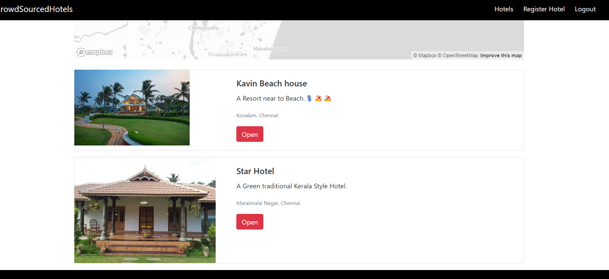
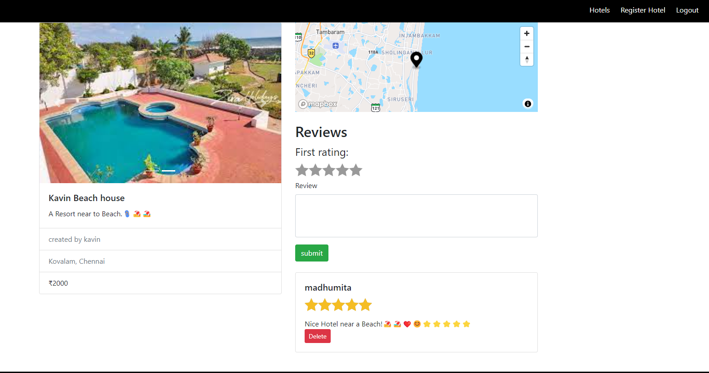

## Crowd Sourced Hotels

It is a platform where hotel owners can showcase their properties to travelers from around the world. This system allows travelers to rate and review their experiences, providing valuable insights for fellow adventurers.

## Screenshots

## Features

- Hotel Owners can creata a account on the platform and Register their Hotel with Information such as Hotel name, Price per day, Location of the Hotel.

- The Location of the Hotel will be shown in the Map.
- Only Hotel Owner can Edit, Delete his Hotel on the site.

- Travellers can create a Account and leave Reviews for the Hotels that they have visited.

- Only the Person who created the Review will be able to Delete it.

## Badges

## Demo

⚠️⚠️⚠️Wait for 1-3 minutes. Unused Web applications hosted through free tier on https://render.com/ are taken off from server. Once the request to the Site is made the Website will be brought back to the Server after some Time.

https://cshotels.onrender.com/
